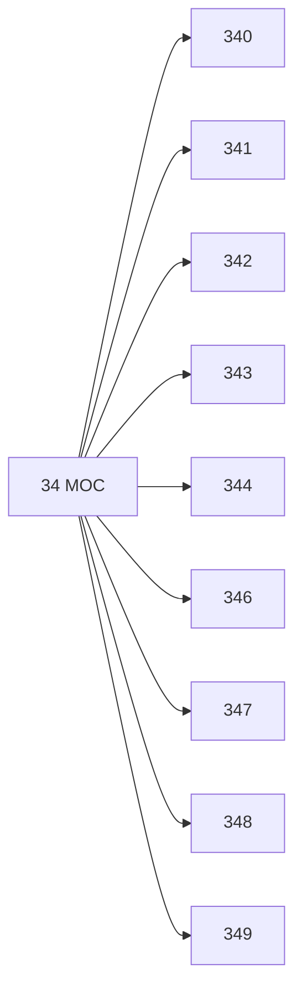

# 🗺️ Map of Content: 34 Law. Jurisprudence

## Visual

## List
* [340 Law in general. Legal methods and auxiliary sciences](340_Law_in_general_Legal_methods_and_auxiliary_sciences.md)
* [341 International law](341_International_law.md)
* [342 Public law. Constitutional law. Administrative law](342_Public_law_Constitutional_law_Administrative_law.md)
* [343 Criminal law. Penal offences](343_Criminal_law_Penal_offences.md)
* [344 Special criminal law. Military, naval, air force laws](344_Special_criminal_law_Military_naval_air_force_laws.md)
* [346 Economic law. Law of government control of the economy](346_Economic_law_Law_of_government_control_of_the_economy.md)
* [347 Civil law](347_Civil_law.md)
* [348 Ecclesiastical law. Canon law. Religious law (option)](348_Ecclesiastical_law_Canon_law_Religious_law_option.md)
* [349 Special branches of law. Miscellaneous legal matters](349_Special_branches_of_law_Miscellaneous_legal_matters.md)
