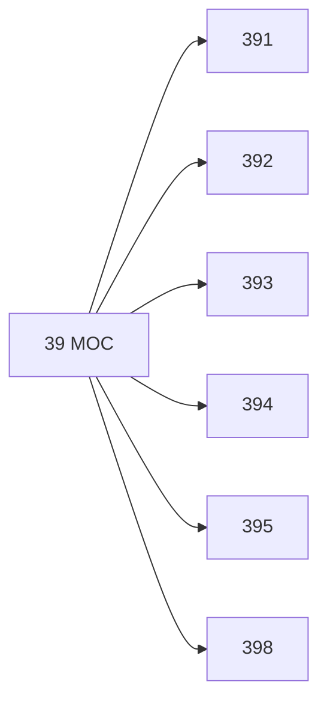

# 🗺️ Map of Content: 39 Cultural anthropology. Ethnography. Customs. Manners. Traditions. Way of life

## Visual

## List
* [391 Costume. Clothing. National dress. Fashion. Adornment](391_Costume_Clothing_National_dress_Fashion_Adornment.md)
* [392 Customs, manners, usage in private life](392_Customs_manners_usage_in_private_life.md)
* [393 Death. Treatment of corpses. Funerals. Death rites](393_Death_Treatment_of_corpses_Funerals_Death_rites.md)
* [394 Public life. Pageantry. Social life. Life of the people](394_Public_life_Pageantry_Social_life_Life_of_the_people.md)
* [395 Social ceremonial. Etiquette. Good manners. Social forms. Rank. Title](395_Social_ceremonial_Etiquette_Good_manners_Social_forms_R.md)
* [398 Folklore in the strict sense](398_Folklore_in_the_strict_sense.md)
