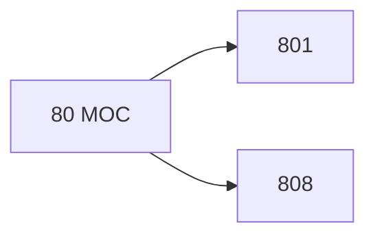

# 🗺️ Map of Content: 80 General questions relating to both linguistics and literature. Philology

## Visual

## List
* [801 Prosody. Auxiliary sciences and sources of philology](801_Prosody_Auxiliary_sciences_and_sources_of_philology.md)
* [808 Rhetoric. The effective use of language](808_Rhetoric_The_effective_use_of_language.md)
