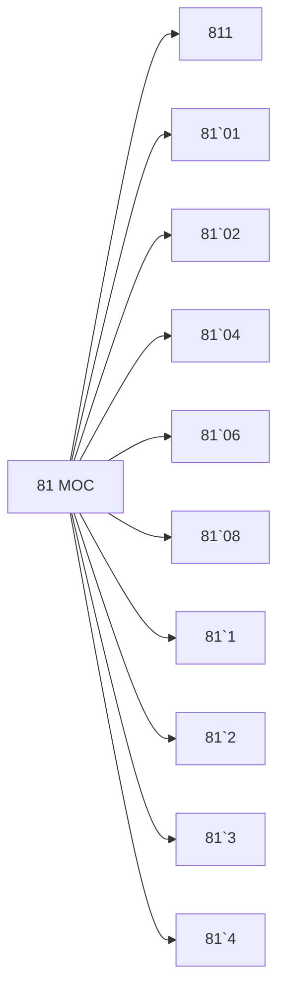

# 🗺️ Map of Content: 81 Linguistics and languages

## Visual

## List
* [811 Languages](811_Languages.md)
* [81`01 Old period. Archaic period](81`01_Old_period_Archaic_period.md)
* [81`02 Classical period](81`02_Classical_period.md)
* [81`04 Middle period](81`04_Middle_period.md)
* [81`06 Modern period](81`06_Modern_period.md)
* [81`08 Revived language](81`08_Revived_language.md)
* [81`1 General linguistics](81`1_General_linguistics.md)
* [81`2 Theory of signs. Theory of translation. Standardization. Usage. Geographical linguistics](81`2_Theory_of_signs_Theory_of_translation_Standardization_.md)
* [81`3 Mathematical and applied linguistics. Phonetics. Graphemics. Grammar. Semantics. Stylistics](81`3_Mathematical_and_applied_linguistics_Phonetics_Graphem.md)
* [81`4 Text linguistics, Discourse analysis. Typological linguistics](81`4_Text_linguistics_Discourse_analysis_Typological_lingui.md)
