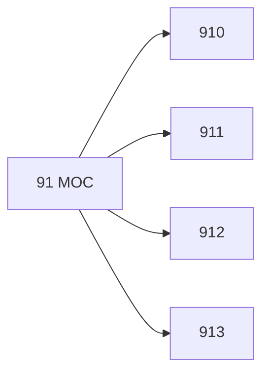

# 🗺️ Map of Content: 91 Geography. Exploration of the Earth and of individual countries. Travel. Regional geography

## Visual

## List
* [910 General questions. Geography as a science. Exploration. Travel](910_General_questions_Geography_as_a_science_Exploration_Tr.md)
* [911 General geography. Science of geographical factors (systematic geography). Theoretical geography](911_General_geography_Science_of_geographical_factors_syste.md)
* [912 Nonliterary, nontextual representations of a region](912_Nonliterary_nontextual_representations_of_a_region.md)
* [913 Regional geography](913_Regional_geography.md)
