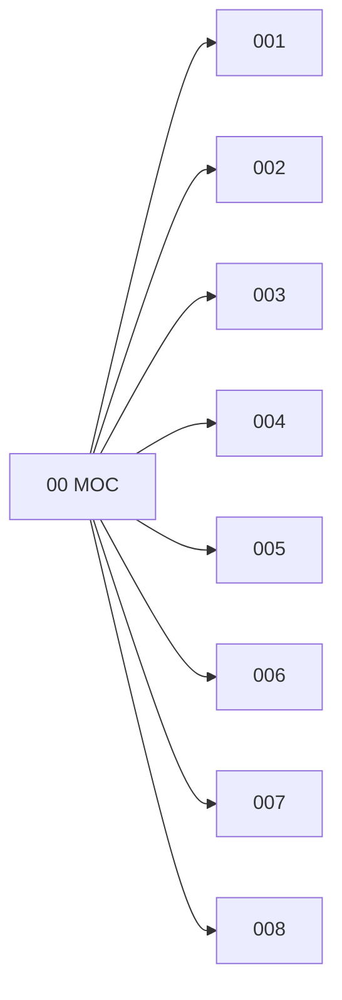

# 🗺️ Map of Content: 00 Prolegomena. Fundamentals of knowledge and culture. Propaedeutics

## Visual

## List
* [001 Science and knowledge in general. Organization of intellectual work](001_Science_and_knowledge_in_general_Organization_of_intell.md)
* [002 Documentation. Books. Writings. Authorship](002_Documentation_Books_Writings_Authorship.md)
* [003 Writing systems and scripts](003_Writing_systems_and_scripts.md)
* [004 Computer science and technology. Computing. Data processing](004_Computer_science_and_technology_Computing_Data_processi.md)
* [005 Management](005_Management.md)
* [006 Standardization of products, operations, weights, measures and time](006_Standardization_of_products_operations_weights_measures.md)
* [007 Activity and organizing. Communication and control theory generally (cybernetics). 'Human engineering'](007_Activity_and_organizing_Communication_and_control_theor.md)
* [008 Civilization. Culture. Progress](008_Civilization_Culture_Progress.md)
