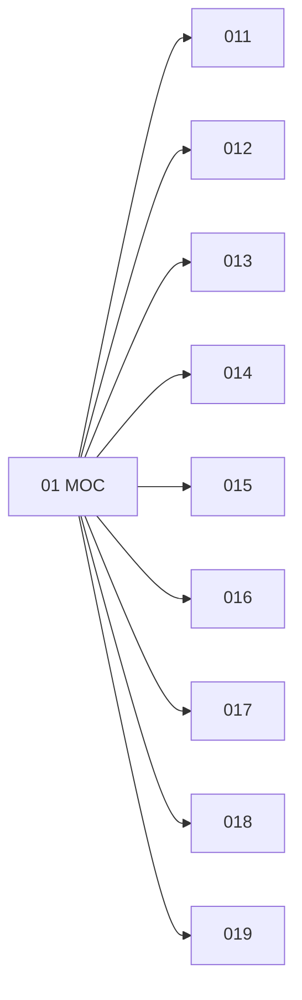

# 🗺️ Map of Content: 01 Bibliography and bibliographies. Catalogues

## Visual

## List
* [011 Universal and general bibliographies](011_Universal_and_general_bibliographies.md)
* [012 Author bibliographies. Individual bibliographies](012_Author_bibliographies_Individual_bibliographies.md)
* [013 Collective bibliographies](013_Collective_bibliographies.md)
* [014 Bibliographies of works of particular characteristics](014_Bibliographies_of_works_of_particular_characteristics.md)
* [015 Bibliographies of place](015_Bibliographies_of_place.md)
* [016 Special subject bibliographies](016_Special_subject_bibliographies.md)
* [017 Catalogues in general. Subject catalogues](017_Catalogues_in_general_Subject_catalogues.md)
* [018 Name catalogues](018_Name_catalogues.md)
* [019 Dictionary catalogues](019_Dictionary_catalogues.md)
