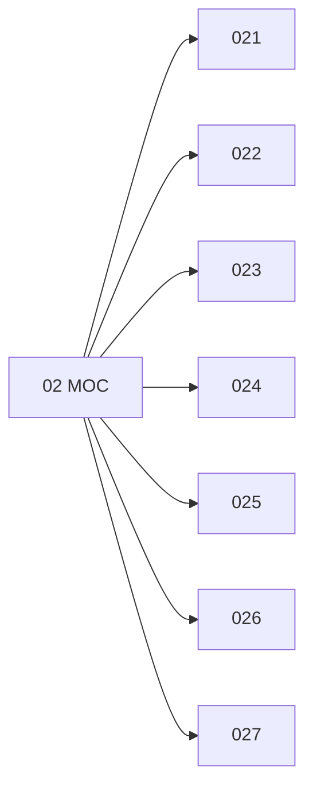

# 🗺️ Map of Content: 02 Librarianship

## Visual

## List
* [021 Function, value, utility, creation, development of libraries](021_Function_value_utility_creation_development_of_librarie.md)
* [022 Library site, building, premises. Equipment](022_Library_site_building_premises_Equipment.md)
* [023 Library administration. Staff. Personnel](023_Library_administration_Staff_Personnel.md)
* [024 Relations with the public. Regulations for library use](024_Relations_with_the_public_Regulations_for_library_use.md)
* [025 Administrative departments of libraries](025_Administrative_departments_of_libraries.md)
* [026 Special libraries](026_Special_libraries.md)
* [027 General libraries](027_General_libraries.md)
