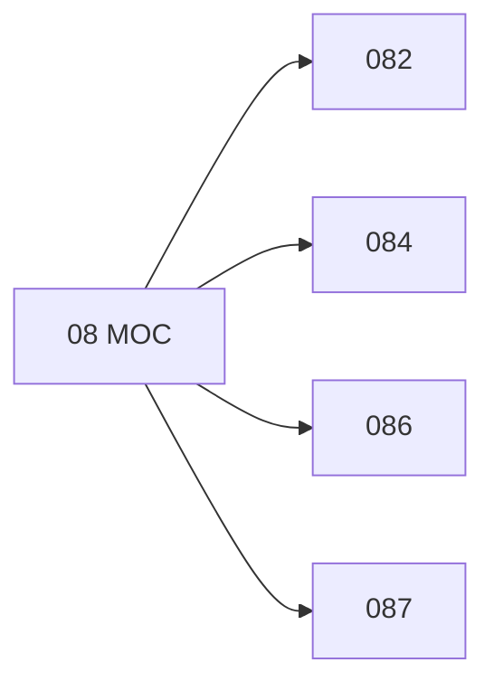

# 🗺️ Map of Content: 08 Polygraphies. Collective works

## Visual

## List
* [082 Collective polygraphy](082_Collective_polygraphy.md)
* [084 Pictorial material](084_Pictorial_material.md)
* [086 Documents of particular form](086_Documents_of_particular_form.md)
* [087 Documents of particular origin or destination](087_Documents_of_particular_origin_or_destination.md)
