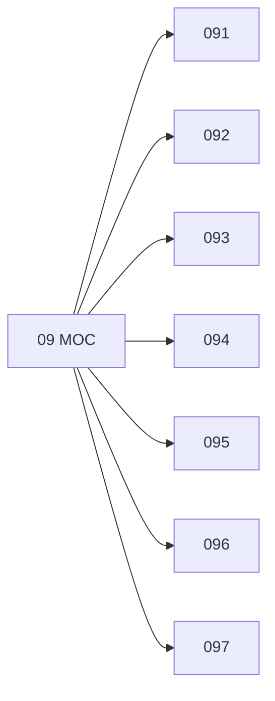

# 🗺️ Map of Content: 09 Manuscripts. Rare and remarkable works

## Visual

## List
* [091 Manuscripts](091_Manuscripts.md)
* [092 Xylographic books](092_Xylographic_books.md)
* [093 Incunabula](093_Incunabula.md)
* [094 Other precious, remarkable or rare printed works](094_Other_precious_remarkable_or_rare_printed_works.md)
* [095 Books remarkable for their binding](095_Books_remarkable_for_their_binding.md)
* [096 Books remarkable for their illustrations or for materials used](096_Books_remarkable_for_their_illustrations_or_for_materia.md)
* [097 Marks of ownership or origin](097_Marks_of_ownership_or_origin.md)
