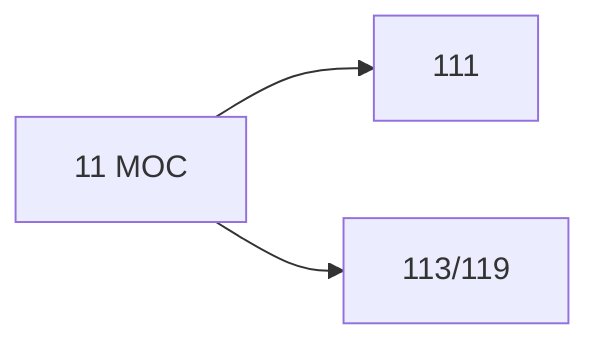

# 🗺️ Map of Content: 11 Metaphysics

## Visual

## List
* [111 General metaphysics. Ontology](111_General_metaphysics_Ontology.md)
* [113/119 Cosmology. Philosophy of nature](113-119_Cosmology_Philosophy_of_nature.md)
