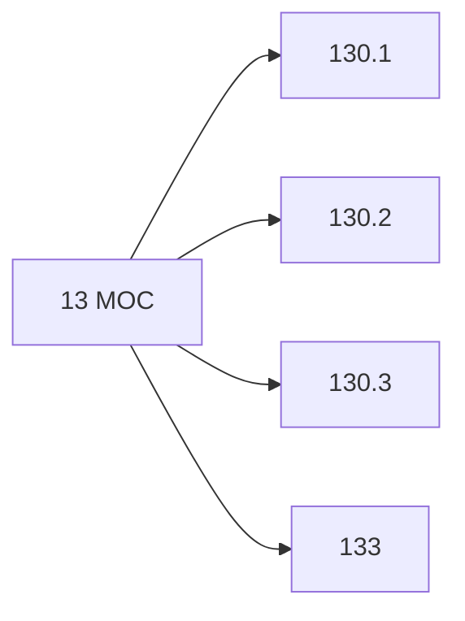

# 🗺️ Map of Content: 13 Philosophy of mind and spirit. Metaphysics of spiritual life

## Visual

## List
* [130.1 General concepts and laws](130.1_General_concepts_and_laws.md)
* [130.2 Philosophy of culture. Cultural systems. Theory of cultural complexes](130.2_Philosophy_of_culture_Cultural_systems_Theory_of_cult.md)
* [130.3 Metaphysics of spiritual life](130.3_Metaphysics_of_spiritual_life.md)
* [133 The paranormal. The occult. Psi phenomena](133_The_paranormal_The_occult_Psi_phenomena.md)
