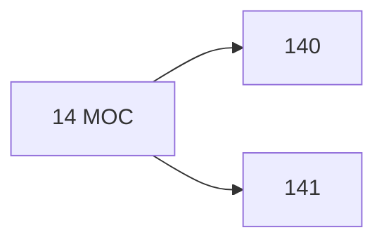

# 🗺️ Map of Content: 14 Philosophical systems and points of view

## Visual

## List
* [140 Possible philosophical attitudes. System typology](140_Possible_philosophical_attitudes_System_typology.md)
* [141 Kinds of viewpoint](141_Kinds_of_viewpoint.md)
