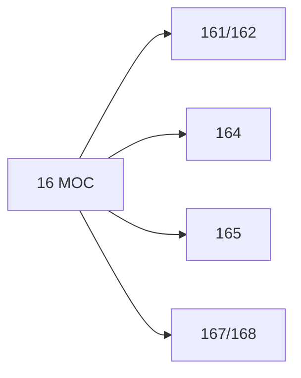

# 🗺️ Map of Content: 16 Logic. Epistemology. Theory of knowledge. Methodology of logic

## Visual

## List
* [161/162 Fundamentals of logic](161-162_Fundamentals_of_logic.md)
* [164 Logistic. Symbolic logic. Mathematical logic. Logical calculus](164_Logistic_Symbolic_logic_Mathematical_logic_Logical_calc.md)
* [165 Theory of knowledge. Epistemology](165_Theory_of_knowledge_Epistemology.md)
* [167/168 Logical methodology](167-168_Logical_methodology.md)
