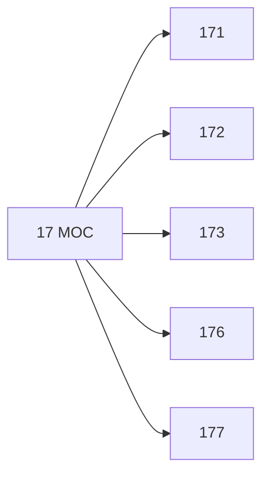

# 🗺️ Map of Content: 17 Moral philosophy. Ethics. Practical philosophy

## Visual

## List
* [171 Individual ethics. Human duties to oneself](171_Individual_ethics_Human_duties_to_oneself.md)
* [172 Social ethics. Duties to one`s fellow humans](172_Social_ethics_Duties_to_ones_fellow_humans.md)
* [173 Family ethics](173_Family_ethics.md)
* [176 Sexual ethics. Sexual morality](176_Sexual_ethics_Sexual_morality.md)
* [177 Ethics and society](177_Ethics_and_society.md)
