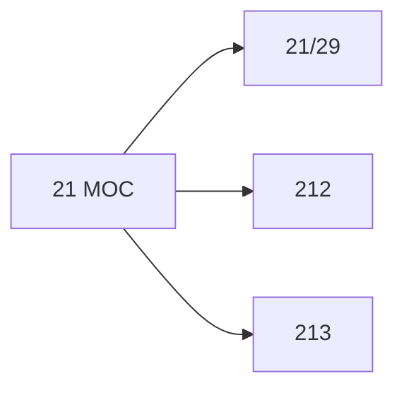

# 🗺️ Map of Content: 21 Prehistoric religions. Religions of early societies

## Visual

## List
* [21/29 Religious systems. Religions and faiths](21-29_Religious_systems_Religions_and_faiths.md)
* [212 Prehistoric religions](212_Prehistoric_religions.md)
* [213 Religions of early societies](213_Religions_of_early_societies.md)
