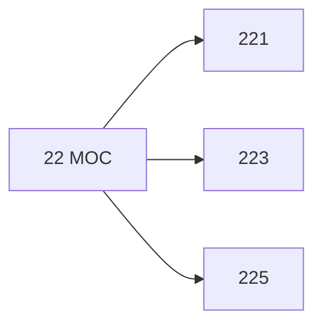

# 🗺️ Map of Content: 22 Religions originating in the Far East

## Visual

## List
* [221 Religions of China](221_Religions_of_China.md)
* [223 Religions of Korea](223_Religions_of_Korea.md)
* [225 Religions of Japan](225_Religions_of_Japan.md)
