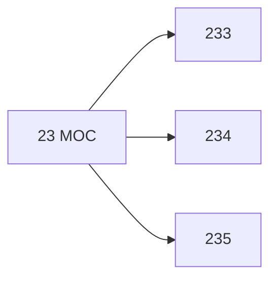

# 🗺️ Map of Content: 23 Religions originating in Indian sub-continent. Hindu religion in the broad sense

## Visual

## List
* [233 Hinduism narrowly](233_Hinduism_narrowly.md)
* [234 Jainism](234_Jainism.md)
* [235 Sikhism](235_Sikhism.md)
