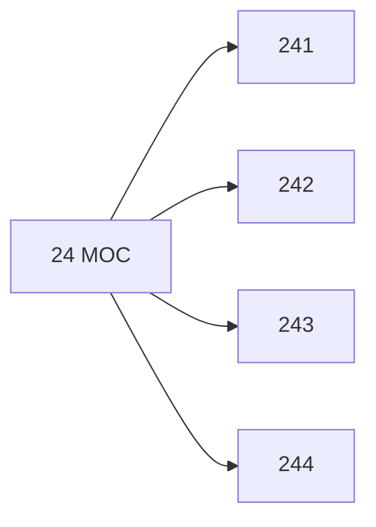

# 🗺️ Map of Content: 24 Buddhism

## Visual

## List
* [241 Hinayana Buddhism. The lesser vehicle. Theravada Buddhism. Pali school](241_Hinayana_Buddhism_The_lesser_vehicle_Theravada_Buddhism.md)
* [242 Mahayana Buddhism. The great vehicle](242_Mahayana_Buddhism_The_great_vehicle.md)
* [243 Lamaism](243_Lamaism.md)
* [244 Japanese Buddhism](244_Japanese_Buddhism.md)
