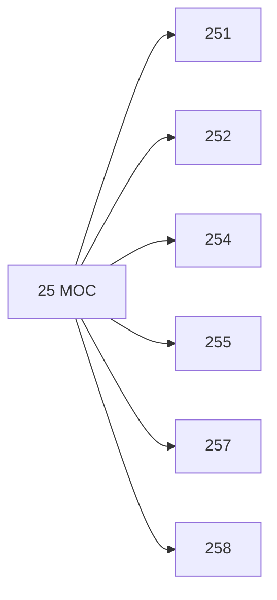

# 🗺️ Map of Content: 25 Religions of antiquity. Minor cults and religions

## Visual

## List
* [251 Ancient Egyptian religion](251_Ancient_Egyptian_religion.md)
* [252 Religions of Mesopotamia](252_Religions_of_Mesopotamia.md)
* [254 Religions of Iran](254_Religions_of_Iran.md)
* [255 Religions of classical antiquity](255_Religions_of_classical_antiquity.md)
* [257 Religions of Europe](257_Religions_of_Europe.md)
* [258 Religions of South and Central America. Pre-Columbian indigenous religions](258_Religions_of_South_and_Central_America_PreColumbian_ind.md)
