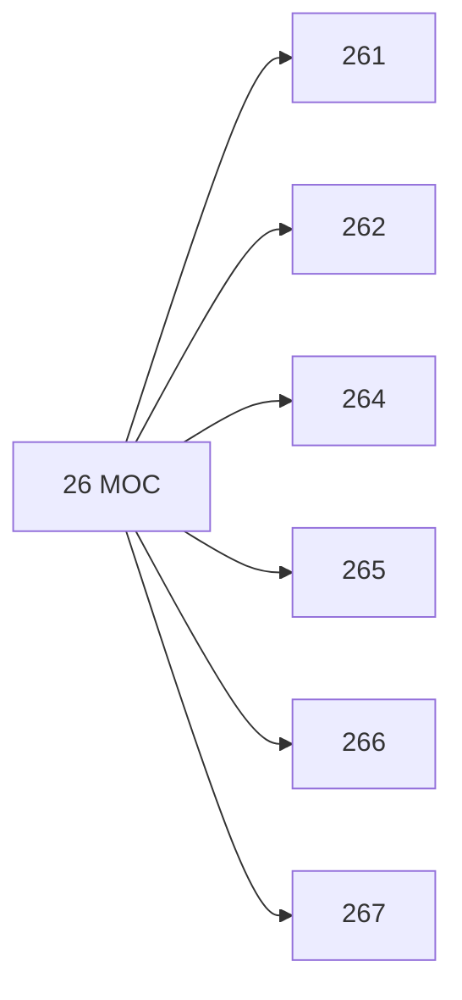

# 🗺️ Map of Content: 26 Judaism

## Visual

## List
* [261 Religion of the Biblical period. Ancient Judaism. Old Testament religion](261_Religion_of_the_Biblical_period_Ancient_Judaism_Old_Tes.md)
* [262 Ashkenazi Judaism](262_Ashkenazi_Judaism.md)
* [264 Sephardi Judaism](264_Sephardi_Judaism.md)
* [265 Orthodox Judaism](265_Orthodox_Judaism.md)
* [266 Progressive Judaism](266_Progressive_Judaism.md)
* [267 Modern movements arising from Judaism](267_Modern_movements_arising_from_Judaism.md)
