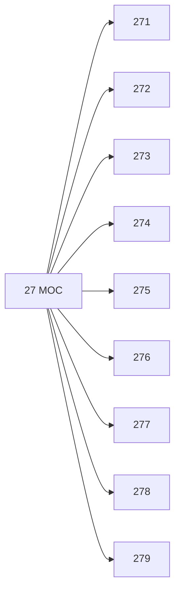

# 🗺️ Map of Content: 27 Christianity

## Visual

## List
* [271 Eastern Church. Eastern Christianity](271_Eastern_Church_Eastern_Christianity.md)
* [272 Roman Catholic church](272_Roman_Catholic_church.md)
* [273 Non-Roman Catholic episcopal churches](273_NonRoman_Catholic_episcopal_churches.md)
* [274 Protestantism generally. Protestants. Dissenters. Puritans](274_Protestantism_generally_Protestants_Dissenters_Puritans.md)
* [275 Re-formed churches](275_Reformed_churches.md)
* [276 Anabaptists](276_Anabaptists.md)
* [277 Free churches. Non-conformists](277_Free_churches_Nonconformists.md)
* [278 Other protestant churches](278_Other_protestant_churches.md)
* [279 Modern Christian movements and churches](279_Modern_Christian_movements_and_churches.md)
