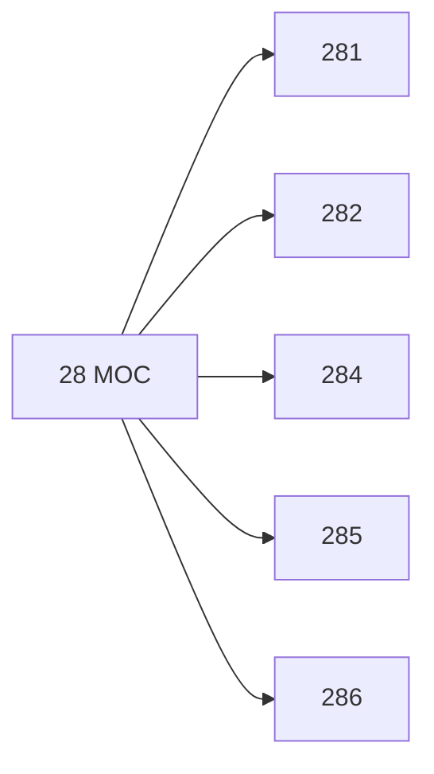

# 🗺️ Map of Content: 28 Islam

## Visual

## List
* [281 Sufism](281_Sufism.md)
* [282 Sunni. Sunnite Islam](282_Sunni_Sunnite_Islam.md)
* [284 Shi'a. Shi'ite Islam](284_Shia_Shiite_Islam.md)
* [285 Babi-Baha'i](285_BabiBahai.md)
* [286 Baha'i](286_Bahai.md)
