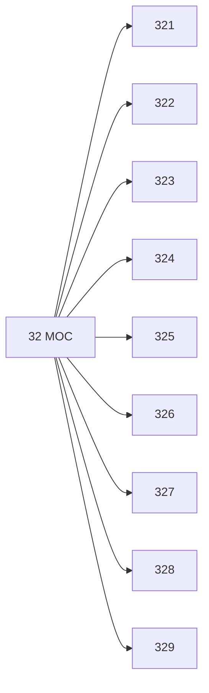

# 🗺️ Map of Content: 32 Politics

## Visual

## List
* [321 Forms of political organization. States as political powers](321_Forms_of_political_organization_States_as_political_pow.md)
* [322 Relations between church and state. Policy towards religion. Church policy](322_Relations_between_church_and_state_Policy_towards_relig.md)
* [323 Home affairs. Internal policy](323_Home_affairs_Internal_policy.md)
* [324 Elections. Plebiscites. Referendums. Election campaigns. Electoral corruption, malpractice. Election results](324_Elections_Plebiscites_Referendums_Election_campaigns_El.md)
* [325 Opening up of territories. Colonization. Colonialism](325_Opening_up_of_territories_Colonization_Colonialism.md)
* [326 Slavery. Involuntary, unfree labour](326_Slavery_Involuntary_unfree_labour.md)
* [327 International relations. World, global politics. International affairs. Foreign policy](327_International_relations_World_global_politics_Internati.md)
* [328 Parliaments. Representation of the people. Governments](328_Parliaments_Representation_of_the_people_Governments.md)
* [329 Political parties and movements](329_Political_parties_and_movements.md)
