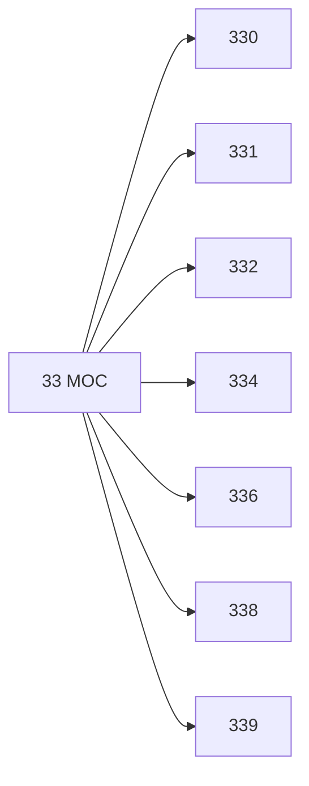

# 🗺️ Map of Content: 33 Economics. Economic science

## Visual

## List
* [330 Economics in general](330_Economics_in_general.md)
* [331 Labour. Employment. Work. Labour economics. Organization of labour](331_Labour_Employment_Work_Labour_economics_Organization_of.md)
* [332 Regional economics. Territorial economics. Land economics. Housing economics](332_Regional_economics_Territorial_economics_Land_economics.md)
* [334 Forms of organization and cooperation in the economy](334_Forms_of_organization_and_cooperation_in_the_economy.md)
* [336 Finance](336_Finance.md)
* [338 Economic situation. Economic policy. Management of the economy. Economic planning. Production. Services. Prices](338_Economic_situation_Economic_policy_Management_of_the_ec.md)
* [339 Trade. Commerce. International economic relations. World economy](339_Trade_Commerce_International_economic_relations_World_e.md)
