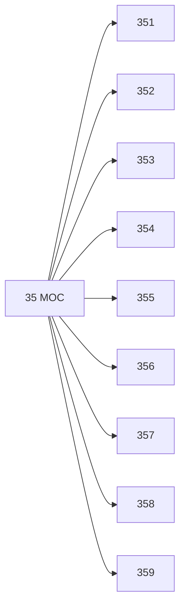

# 🗺️ Map of Content: 35 Public administration. Government. Military affairs

## Visual

## List
* [351 Particular activities of public administration](351_Particular_activities_of_public_administration.md)
* [352 Lowest levels of administration. Local government. Municipal administration. Local authorities](352_Lowest_levels_of_administration_Local_government_Munici.md)
* [353 Middle levels of administration. Regional, provincial government. Regional authorities](353_Middle_levels_of_administration_Regional_provincial_gov.md)
* [354 High level, top level of administration. Central, national government](354_High_level_top_level_of_administration_Central_national.md)
* [355 Military affairs generally](355_Military_affairs_generally.md)
* [356 Army service generally. Infantry. Foot soldiers](356_Army_service_generally_Infantry_Foot_soldiers.md)
* [357 Cavalry. Mounted troops. Motorized troops](357_Cavalry_Mounted_troops_Motorized_troops.md)
* [358 Artillery. Engineers. Aviation. Various technical units and their function](358_Artillery_Engineers_Aviation_Various_technical_units_an.md)
* [359 Naval forces. Military fleet. Navy: personnel, organization](359_Naval_forces_Military_fleet_Navy_personnel_organization.md)
