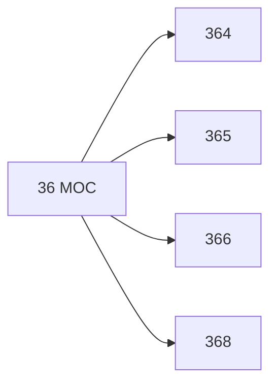

# 🗺️ Map of Content: 36 Safeguarding the mental and material necessities of life

## Visual

## List
* [364 Social welfare](364_Social_welfare.md)
* [365 Accommodation desires and their fulfilment. Safeguarding accommodation](365_Accommodation_desires_and_their_fulfilment_Safeguarding.md)
* [366 Consumerism](366_Consumerism.md)
* [368 Insurance. Communal provision through sharing of risk](368_Insurance_Communal_provision_through_sharing_of_risk.md)
