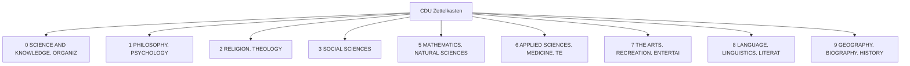

# Zettelkasten CDU

Welcome to the Universal Decimal Classification Zettelkasten system.

## UDC Domains Overview

## Primary Branches

| Icon | Code | Title |
|---|---|---|
| 🔬 | 0 | [SCIENCE AND KNOWLEDGE. ORGANIZATION. COMPUTER SCIENCE. INFORMATION. DOCUMENTATION. LIBRARIANSHIP. INSTITUTIONS. PUBLICATIONS](0_SCIENCE_AND_KNOWLEDGE_ORGANIZATION_COMPUTER_SCIENCE_INFOR/0_SCIENCE_AND_KNOWLEDGE_ORGANIZATION_COMPUTER_SCIENCE_INFOR.md) |
| 🧠 | 1 | [PHILOSOPHY. PSYCHOLOGY](1_PHILOSOPHY_PSYCHOLOGY/1_PHILOSOPHY_PSYCHOLOGY.md) |
| ⛪ | 2 | [RELIGION. THEOLOGY](2_RELIGION_THEOLOGY/2_RELIGION_THEOLOGY.md) |
| ⚖️ | 3 | [SOCIAL SCIENCES](3_SOCIAL_SCIENCES/3_SOCIAL_SCIENCES.md) |
| 📐 | 5 | [MATHEMATICS. NATURAL SCIENCES](5_MATHEMATICS_NATURAL_SCIENCES/5_MATHEMATICS_NATURAL_SCIENCES.md) |
| ⚙️ | 6 | [APPLIED SCIENCES. MEDICINE. TECHNOLOGY](6_APPLIED_SCIENCES_MEDICINE_TECHNOLOGY/6_APPLIED_SCIENCES_MEDICINE_TECHNOLOGY.md) |
| 🎨 | 7 | [THE ARTS. RECREATION. ENTERTAINMENT. SPORT](7_THE_ARTS_RECREATION_ENTERTAINMENT_SPORT/7_THE_ARTS_RECREATION_ENTERTAINMENT_SPORT.md) |
| 📚 | 8 | [LANGUAGE. LINGUISTICS. LITERATURE](8_LANGUAGE_LINGUISTICS_LITERATURE/8_LANGUAGE_LINGUISTICS_LITERATURE.md) |
| 🌍 | 9 | [GEOGRAPHY. BIOGRAPHY. HISTORY](9_GEOGRAPHY_BIOGRAPHY_HISTORY/9_GEOGRAPHY_BIOGRAPHY_HISTORY.md) |

---
Generated by Antigravity AI.
